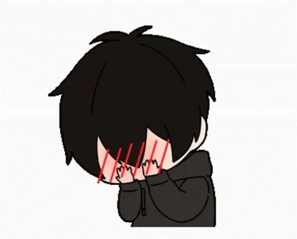

<h1 align="center">👋, 𝘐'𝘮 Aayush! 💠</h1>

  

 

<h1 align="center">𝗔𝗕𝗢𝗨𝗧 𝗠𝗘</h1>

<ul>
  <li> 📺 Currently watching <b>solo leveling</b></li>
  <li> 🔭 I’m currently working on <b>working on microservices(my prof made me do so)</b></li>
  <li> 🎮 I’m currently playing <b>GTA V</b> or <b>The 1975</b></li>
  <li> 📫 How to reach me: <b>aayushprajapati0807@gmail.com</b></li>
</ul>

 

<h1 align="center">𝗞𝗡𝗢𝗪𝗟𝗘𝗗𝗚𝗘</h1>

  

    A computer enthusiast passionate about Back‑end Development, CyberSecurity, Linux, and creative problem‑solving.
  

    

    
    
    
    
    
    
    
    
    
    
    
    
  

 

<h1 align="center">𝗦𝗢𝗖𝗜𝗔𝗟𝗦</h1>

  
  
  
   
  

              
