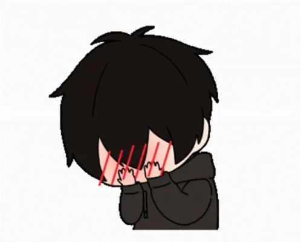

<h1 align="center">👋, 𝘐'𝘮 Aayush! 💠</h1>

#### 🔨 Check out my recent pull requests
- [Feat: add chunking streaming in tts](https://github.com/liquidos-ai/AutoAgents/pull/187) on [AutoAgents](https://github.com/liquidos-ai/AutoAgents)
- [fix(skills): add pdf-reading skill to prevent Chrome screenshot content](https://github.com/different-ai/openwork/pull/891) on [openwork](https://github.com/different-ai/openwork)
- [fix: On macOS, GUI applications don't inherit shell profile modifications](https://github.com/different-ai/openwork/pull/563) on [openwork](https://github.com/different-ai/openwork)
- [fix: Fixed editor mode file open failing](https://github.com/different-ai/openwork/pull/634) on [openwork](https://github.com/different-ai/openwork)
- [feat(app): add option to hide window titlebar on Linux](https://github.com/different-ai/openwork/pull/465) on [openwork](https://github.com/different-ai/openwork)
- [Feat: GitHub remove org membership to free seat](https://github.com/ShipSecAI/studio/pull/65) on [ShipSecAi](https://github.com/ShipSecAI/studio)

#### 👷 Check out what I'm currently working on
- [different-ai/openwork(yc26)](https://github.com/different-ai/openwork) - An Open source alternative to claude code
- [liquidos-ai/autoagents](https://github.com/liquidos-ai/AutoAgents) - A production-grade multi-agent framework in Rust

 

<h1 align="center">𝗞𝗡𝗢𝗪𝗟𝗘𝗗𝗚𝗘</h1>

  

    A computer enthusiast passionate about Back‑end Development, CyberSecurity, Linux, and creative problem‑solving.
  

    

          
     
    
    
    
    
    
    
    
    
    
    
    
  

 

<h1 align="center">𝗦𝗢𝗖𝗜𝗔𝗟𝗦</h1>

  
  
  
   
  

              
